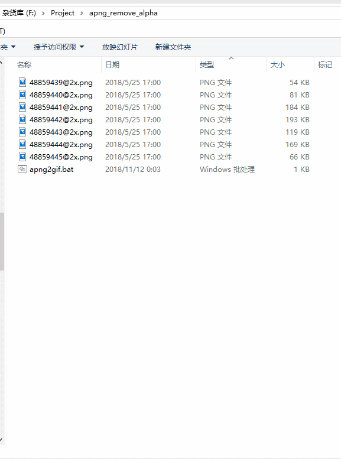
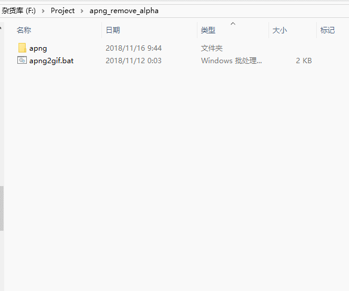

# apng2gif
将 apng 动画转换为白底的 gif 动画，适用于 Line 动态贴图转换。

使用前需要将 ffmpeg 放入系统 PATH，或者将```set "ffmpeg=ffmpeg"```更改为 ```set ffmpeg="ffmpeg的完整路径"```

如果不会以上操作，那么请下载```ffmpeg.exe```放到和批处理相同目录下。

如果需要转换为背景透明的 gif 则将 ```set /A whitebgd = 1``` 更改为 ```set /A whitebgd = 0```，但不推荐使用，因为 gif 不支持半透明，只有透明和不透明，输出的gif将可能会有白边。

## 如何运行
- 将批处理放在存放 apng 的文件夹中双击运行。
- 将存放 apng 的文件夹拖放到批处理上。

**转换输出的 gif 会与 apng 同名存放在 apng 同目录下**

**转换期间会生成一个名为 temp 的临时目录，全部转换完成后会自动删除**

## 更新记录
v1.1更新-20181116
- 添加ffmpeg.exe，方便小白下载。
- 支持调用和批处理同一目录下的ffmpeg。
- readme 添加演示图。

## 演示

### 直接在apng目录下运行


### 将apng文件夹拖放到批处理



